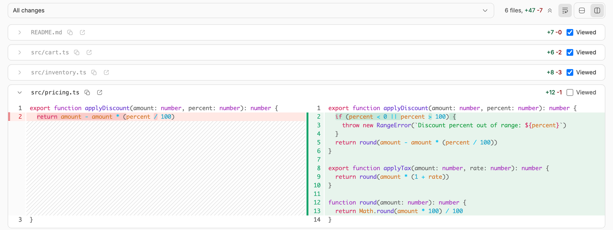

# Diff Viewed

Keep your place in a long diff. Every file in bb's changes panel gets a
**Viewed** checkbox: check it and the file collapses, its header dims, and it
stays that way until the file's diff changes.



## Use

- Open the changes panel (⌘ D). Each file header now ends with a **Viewed**
  checkbox beside its `+N -M` counts.
- Check a file to fold it away. What is still expanded is what you have not
  read yet.
- Uncheck it to bring it back. Nothing else about the panel changes.

Marks are kept per thread and survive a reload and a restart of bb. Another
open window picks up a change when it regains focus.

## What clears a mark

A mark is keyed on the thread, the file path, and the file's `+N -M` counts.
Because the counts are part of the key, the mark clears itself when the file's
diff changes: rebase the branch, add a hunk, or revert the file, and it comes
back expanded and undimmed. An edit that adds and removes the same number of
lines keeps the mark, since the counts carry no other per-file signal.

Marks for files that leave the diff are pruned when the panel next loads.

## Install

This repository holds several plugins, so the install names which one and where
its release tags live:

```sh
bb plugin install git:https://github.com/danielbachhuber/bb-plugins.git@^0.1.0 \
  --plugin diff-viewed --tag-prefix diff-viewed/
```

Needs bb 0.41 or later. No account, external service, or separate install.

## Related plugins

- **Guided Review** (`guided-review`) also tracks viewed files, inside its own
  reading guide for a GitHub pull request or a local Git range. Diff Viewed
  puts the mark on bb's own changes panel for the thread you are in, needs no
  GitHub sign-in or agent provider, and clears a mark when that file's diff
  changes.

## How it works

bb owns the diff card header. `experimental_diffRenderer` replaces a diff's
*body*, and the header's `statSlot` / `actionSlot` are internal, so the checkbox
cannot come from a normal plugin slot. It comes from a content script instead,
which is what the SDK sanctions for decorating existing app-shell DOM.

The script anchors only on things bb emits deliberately:

| Anchor | Used for |
| --- | --- |
| `[data-timeline-file-diff]` | Skipping timeline diffs |
| `aria-label="Collapse <path>"` | Reading each card's file path |
| `aria-expanded` | Reading and driving collapse |
| `[data-testid="git-diff-toolbar-actions"]` | Knowing the changes panel is open |

No minified class names. If bb changes the header and the anchors stop
matching, the plugin decorates nothing and bb behaves exactly as it does
without it.

Marks live in the plugin's kv storage, which is what makes them survive a
reload. Another window picks them up on focus rather than live, because
realtime subscription is a React-side API and a content script has no component
to hang it on.

There is deliberately no "card must be inside container X" check. bb's file
card list carries no attribute of its own, and `data-secondary-panel-tab-content`
— which reads like the right one — is the *tab strip's* inner container, not a
tab's content. Requiring it matched nothing on any screen. The structural checks
in `resolveCard` carry that weight instead: the collapse button must be the
first child of the header's left span, and the header row must have exactly two
children and `justify-between`.

## Layout

| Path | Holds |
| --- | --- |
| `viewed/marks.ts` | Pure logic: keying, fingerprinting, record changes |
| `viewed/dom.ts` | Reading and decorating bb's card headers |
| `viewed/engine.ts` | The sync loop: passes, observers, click handling, cleanup |
| `server.ts` | RPC contract and kv storage boundary |
| `app.tsx` | Wiring only: real fetch, real scheduler, real document |

## Development

```sh
npm install
npm test
npm run typecheck
bb plugin build && bb plugin reload diff-viewed
```

`viewed/engine.test.ts` drives the whole loop against a DOM shaped like bb's,
with a stand-in for React that flips `aria-expanded` on click. The engine is
split out of `app.tsx` precisely so it can be tested: every bug this plugin has
shipped lived in that loop and survived a green run, because only the pure
functions had tests.

`viewed/dom.test.ts` holds a fixture of the card header DOM as bb renders it.
After a bb upgrade, those are the tests that fail first; re-read
`GitDiffCardHeader-*.js` in bb's `app/dist/assets` and update the fixture and
`viewed/dom.ts` together.

The RPC surface against a running server:

```sh
BASE=$(node -p "require(process.env.HOME+'/.bb/bb-app-runtime.json').serverUrl")
curl -s -X POST -H "content-type: application/json" -H "origin: $BASE" \
  -d '{"threadId":"thr_x"}' "$BASE/api/v1/plugins/diff-viewed/rpc/viewed_list"
```
