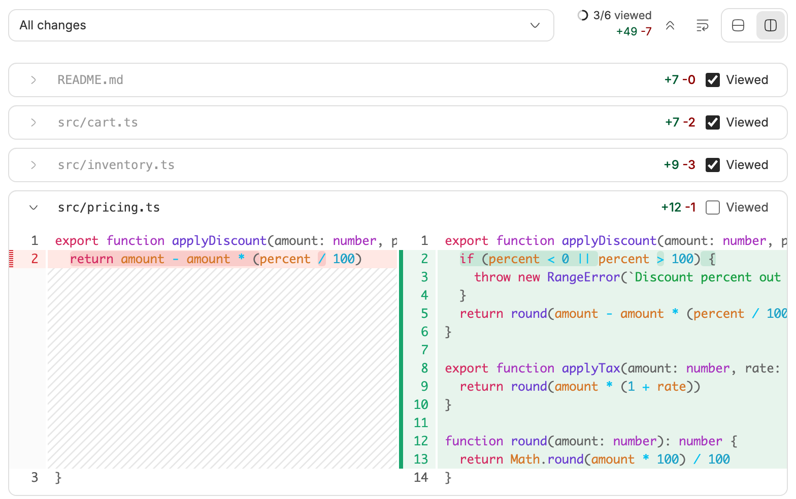
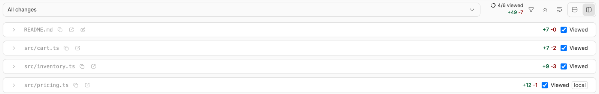

# Diff Viewed

Keep your place in a long diff. Every file in bb's changes panel gets a
**Viewed** checkbox: check it and the file collapses, its header dims, and it
stays that way until the file's diff changes.



## Use

- Open the changes panel (⌘ D). Each file header now ends with a **Viewed**
  checkbox beside its `+N -M` counts.
- Check a file to fold it away. What is still expanded is what you have not
  read yet.
- Uncheck it to bring it back. Nothing else about the panel changes.
- bb's **Expand all files** button in the toolbar opens only the files you
  have not viewed. A viewed file stays collapsed until you open it yourself.
- The toolbar shows how far you have got, as "3/8 viewed" with a progress
  ring, right-aligned above bb's line counts in place of bb's file count. It
  counts every file in the selected range, including the ones you have not
  scrolled to yet, and a file only counts while its mark matches its current
  diff.
- To hide viewed files entirely, open the range dropdown at the top of the
  panel ("All changes", "Uncommitted changes") and pick **Only unviewed** at
  the bottom. Pick it again to show every file. The choice applies to every
  thread and is remembered across restarts.

The Only unviewed item is not in bb's keyboard navigation for that menu, so it
takes a click. On a narrow window, where bb shows the menu as a sheet, the item
is not offered.

Marks are kept per thread and survive a reload and a restart of bb. Another
open window picks up a change when it regains focus.

## Sync with GitHub

When the thread has an open pull request, the Viewed checkbox and GitHub's
own **Viewed** box on the pull request's Files changed tab are the same mark.
Check a file in bb and it shows as viewed on GitHub. Mark or unmark it on
GitHub and bb shows the change the next time the window regains focus.

That holds only for a file whose diff in bb is the one on GitHub, judged by
the same `+N -M` counts that key a mark. When they differ, for example because
you have edits that are not pushed yet, or you are looking at Uncommitted
changes, a cloud with a slash through it, meaning **Local**, shows before
the checkbox. So does every file in a thread with no open pull request. You
can still check it, which is how you review your own diff before pushing, and
the mark stays in bb. Hover the checkbox to see which kind of mark it is.

When you open a thread, its marks in bb show at once, and GitHub's Viewed
state takes up to a few seconds to arrive. Until it does, each file shows a
spinner where the Local cloud would go, since the plugin does not yet know
which files sync, and the "viewed" count in the toolbar stays muted and
pulses, counting bb's marks alone. Both settle once GitHub answers.

A Local mark does not stay local for good. Once you push, or open the pull
request, and that file's counts on GitHub match the diff you marked, the
plugin marks it viewed on GitHub too, the next time the panel loads or the
window regains focus. It sends each mark once: unmark the file on GitHub
afterwards and it stays unmarked. A mark you cleared before pushing is not
sent, and a file whose diff changed after you marked it keeps waiting, since
the counts no longer match what you read.



A file GitHub reports as changed since you viewed it shows unchecked, as it
does on GitHub.

Sync uses `gh`, signed in as you (`gh auth login`). Without it, or with no
open pull request, the plugin keeps marks in bb as it otherwise would, and
logs why once. To turn sync off or point at a different `gh`:

```sh
bb plugin config diff-viewed set syncGithub off
bb plugin config diff-viewed set ghPath /opt/homebrew/bin/gh
```

GitHub calls:

- When a thread's panel loads, the marks kept in bb are read first, with no
  GitHub call, so the checkboxes do not wait on GitHub.
- When a thread's panel loads and when the window regains focus, one GraphQL
  query reads the pull request's files with your Viewed state, plus one more
  for each further 100 files. The answer is reused for 30 seconds, and
  requests that overlap share one call, so switching windows back and forth
  does not query again each time.
- Each click on a file that syncs is one mutation. A click on a Local file
  makes no GitHub call.
- Each Local mark that has come to match GitHub's diff is one mutation, sent
  once, on the first load after the push. A file GitHub already shows viewed
  makes no call.
- The thread's pull request is found through bb's own lookup for the
  environment, the one its pull request banner uses.

## What clears a mark

A mark is keyed on the thread, the file path, and the file's `+N -M` counts.
Because the counts are part of the key, the mark clears itself when the file's
diff changes: rebase the branch, add a hunk, or revert the file, and it comes
back expanded and undimmed. An edit that adds and removes the same number of
lines keeps the mark, since the counts carry no other per-file signal.

Marks for files that leave the diff are pruned the next time the panel shows
All changes.

## Install

This repository holds several plugins, so the install names which one and where
its release tags live:

```sh
bb plugin install git:https://github.com/danielbachhuber/bb-plugins.git@^0.1.0 \
  --plugin diff-viewed --tag-prefix diff-viewed/
```

Needs bb 0.41 or later. GitHub sync needs `gh` on PATH and signed in; without
it the plugin works the same, with marks kept in bb.

## Related plugins

- **Guided Review** (`guided-review`) also tracks viewed files, inside its own
  reading guide for a GitHub pull request or a local Git range. Diff Viewed
  puts the mark on bb's own changes panel for the thread you are in, shares it
  with GitHub's Viewed box when the thread has a pull request, works without a
  GitHub sign-in or agent provider, and clears a mark when that file's diff
  changes.

## How it works

bb owns the diff card header. `experimental_diffRenderer` replaces a diff's
*body*, and the header's `statSlot` / `actionSlot` are internal, so the checkbox
cannot come from a normal plugin slot. It comes from a content script instead,
which is what the SDK sanctions for decorating existing app-shell DOM.

The script anchors only on things bb emits deliberately:

| Anchor | Used for |
| --- | --- |
| `[data-timeline-file-diff]` | Skipping timeline diffs |
| `aria-label="Collapse <path>"` | Reading each card's file path |
| `aria-expanded` | Reading and driving collapse |
| `[data-testid="git-diff-toolbar-actions"]` | Knowing the changes panel is open |
| `[data-testid="git-diff-toolbar-selector-slot"]` and the trigger's `aria-controls` | Finding the open range dropdown to add Only unviewed |
| `[data-index]` | The virtualized row to hide while Only unviewed is on, and where the file list is read from |
| `[data-testid="git-diff-toolbar-details"]` | Stacking the progress line above bb's line counts and hiding its file count |

No minified class names. If bb changes the header and the anchors stop
matching, the plugin decorates nothing and bb behaves exactly as it does
without it. The one exception is the full file list, described below.

Marks live in the plugin's kv storage, which is what makes them survive a
reload. Another window picks them up on focus rather than live, because
realtime subscription is a React-side API and a content script has no component
to hang it on.

There is deliberately no "card must be inside container X" check. bb's file
card list carries no attribute of its own, and `data-secondary-panel-tab-content`
— which reads like the right one — is the *tab strip's* inner container, not a
tab's content. Requiring it matched nothing on any screen. The structural checks
in `resolveCard` carry that weight instead: the collapse button must be the
first child of the header's left span, and the header row must have exactly two
children and `justify-between`.

### The full file list

bb draws only the file cards near the scroll position, so the DOM never holds
the whole diff. The progress count and the pruning of old marks both need it,
so they read the `files` prop of bb's `DiffFilesPanel` from the React fiber on
a rendered row, along with `target`, the selected range. This is the one
anchor bb does not emit on purpose, which is why it is checked rather than
trusted: every entry must have the fields the plugin reads, or the read fails
with a reason.

A failed read is not silent. The toolbar shows **Viewed progress
unavailable**, with the reason in its tooltip, and the reason goes to the
plugin's server log once per window:

```sh
bb plugin logs diff-viewed
```

The Viewed checkboxes keep working, and pruning stops, since pruning against
a partial list would delete marks that are still good. Pruning also runs only
on the All changes range, because a narrower range leaves out files whose
marks still apply. To fix a failed read after a bb upgrade, read
`DiffFilesPanel.tsx` in bb's `apps/app/src/components/secondary-panel/git-diff`
and update `viewed/files.ts`.

A mark's fingerprint is `+a -b`. The card header leaves out a zero count on an
added or deleted file and writes thousands with commas, so the header's text
is normalized to match what the file list gives.

### Only unviewed

Only unviewed hides rows with CSS: an attribute on `<html>` turns on a rule
that sets `display: none` on any row containing a header marked viewed. bb's
file list is virtualized, and the virtualizer measures each row with a
`ResizeObserver`, so a hidden row measures as zero height and the rows after it
move up. Nothing else in bb's state changes, which is why the file count in the
toolbar still counts every file.

## Layout

| Path | Holds |
| --- | --- |
| `viewed/marks.ts` | Pure logic: keying, fingerprinting, record changes |
| `viewed/github.ts` | Pure logic: whether a file's mark is GitHub's or local, progress across both, and which Local marks to send once a push makes them match |
| `viewed/pull-request.ts` | Every GitHub call: reading the pull request's files, marking one viewed |
| `viewed/dom.ts` | Reading and decorating bb's card headers, toolbar, and range dropdown |
| `viewed/files.ts` | Reading the panel's full file list from React props |
| `viewed/engine.ts` | The sync loop: passes, observers, click handling, cleanup |
| `server.ts` | RPC contract, kv storage for marks and the filter, settings, and the GitHub cache |
| `app.tsx` | Wiring only: real fetch, real scheduler, real document |

## Development

```sh
npm install
npm test
npm run typecheck
bb plugin build && bb plugin reload diff-viewed
```

`viewed/engine.test.ts` drives the whole loop against a DOM shaped like bb's,
with a stand-in for React that flips `aria-expanded` on click. The engine is
split out of `app.tsx` precisely so it can be tested: every bug this plugin has
shipped lived in that loop and survived a green run, because only the pure
functions had tests.

`viewed/dom.test.ts` holds a fixture of the card header DOM as bb renders it.
After a bb upgrade, those are the tests that fail first; re-read
`GitDiffCardHeader-*.js` in bb's `app/dist/assets` and update the fixture and
`viewed/dom.ts` together.

The RPC surface against a running server:

```sh
BASE=$(node -p "require(process.env.HOME+'/.bb/bb-app-runtime.json').serverUrl")
curl -s -X POST -H "content-type: application/json" -H "origin: $BASE" \
  -d '{"threadId":"thr_x"}' "$BASE/api/v1/plugins/diff-viewed/rpc/viewed_list"
```
